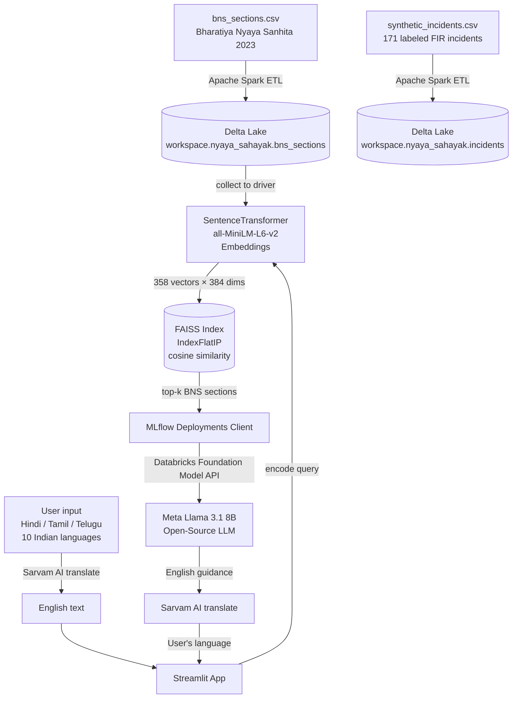

# ⚖️ Nyaya-Sahayak: Governance & Access to Justice

Nyaya-Sahayak is an AI-powered legal assistant that simplifies Indian law (BNS 2023) for common citizens and helps them identify the correct FIR sections for any incident — in their own language. Built entirely on open-source models and Databricks.

---

## Architecture



---

## What it does

**Nyaya-Sahayak** ("Legal Helper") gives every Indian citizen access to legal knowledge in their own language. It has two AI-powered tools:

- **BNS Explanation** — Paste any legal text from BNS 2023 or the Constitution → get a plain-English (or Hindi/Tamil/Telugu etc.) explanation written for a 15-year-old
- **FIR Category Helper** — Describe an incident in any Indian language → FAISS retrieves the most relevant BNS sections → Llama 3.1 8B identifies the offense type and gives step-by-step FIR filing advice → Sarvam AI translates the guidance back to the user's language

---

## Databricks Technologies Used

| Technology | Usage |
|---|---|
| Apache Spark | ETL pipeline — reads CSVs, cleans data, writes Delta tables |
| Delta Lake | Managed storage for BNS sections and incident dataset (Unity Catalog) |
| Databricks Foundation Model APIs | Serves Meta Llama 3.1 8B (open-source) |
| MLflow Deployments | Client to call the Foundation Model API endpoint |
| Unity Catalog | Manages Delta tables and Volume storage |

## Open-Source Models & Tools Used

| Model / Tool | Usage |
|---|---|
| `sentence-transformers/all-MiniLM-L6-v2` | Encodes BNS sections and user queries into vectors |
| `meta-llama/Meta-Llama-3.1-8B-Instruct` | Legal simplification and FIR guidance (via Databricks) |
| FAISS `IndexFlatIP` | Cosine similarity search over BNS section embeddings |
| Sarvam AI `mayura:v1` | Translates between English and 10 Indian languages |

---

## How to Run (Fresh Machine)

### Prerequisites
- Python 3.9+
- Databricks workspace (Free Edition works)
- Databricks Personal Access Token (`dapi...`)
- Sarvam AI API key (free at `https://dashboard.sarvam.ai`)

### 1. Clone the repo
```bash
git clone https://github.com/algorithmalchemist69/nyaya-sahayak.git
cd nyaya-sahayak
```

### 2. Install dependencies
```bash
pip install streamlit faiss-cpu sentence-transformers "numpy<2.0" openai requests
```

### 3. Generate synthetic dataset
```bash
python 01_generate_synthetic_data.py
```

### 4. Build FAISS index
```bash
python 03_build_faiss_index.py
```

### 5. Run the app
```bash
streamlit run 04_nyaya_sahayak_app.py
```

Open `http://localhost:8501` in your browser.

### 6. Configure in the sidebar
- Paste your **Databricks Token** (`dapi...`)
- Paste your **Sarvam AI Key**
- Select your **language** (English, Hindi, Tamil, Telugu, Kannada, Malayalam, Bengali, Marathi, Gujarati, Punjabi, Odia)

---

### Running the Databricks Pipeline (full Spark + Delta Lake flow)

Import these notebooks into Databricks Workspace → run in order using Serverless compute:

```
databricks/nb_00_setup.py        → installs packages
databricks/nb_01_etl.py          → Spark ETL → Delta tables
databricks/nb_02_build_faiss.py  → builds FAISS index
databricks/nb_03_inference_demo.py → interactive demo
```

---

## Demo Steps

### Task 1 — BNS Explanation
1. Open the app → enter tokens in sidebar → select language (e.g. **Hindi**)
2. Click **"📖 BNS Explanation"** tab
3. Paste:
   ```
   Whoever commits theft shall be punished with imprisonment of either description
   for a term which may extend to three years, or with fine, or with both.
   ```
4. Click **Simplify ✨**
5. Get plain-language explanation in **Hindi**

### Task 2 — FIR Category Helper
1. Click **"🚨 FIR Category Helper"** tab
2. Select language **Hindi**, type: `किसी ने मेरी साइकिल चुरा ली`
3. Click **Analyse & Suggest FIR Sections 🔍**
4. App translates to English → FAISS retrieves **BNS Section 305** (Theft) → Llama generates FIR guidance → Sarvam translates back to **Hindi**

Try also:
- `मेरे पति मुझे मारते हैं और दहेज मांगते हैं` → Sec 80 (Dowry Death) + Sec 85 (Cruelty)
- `Someone stole my bike` (English) → Sec 305 (Theft)
- `My phone was hacked` → Cybercrime + Sec 316

---

## Project Write-up (500 characters)

> Nyaya-Sahayak is an AI legal assistant built on Databricks that makes Indian law accessible to everyone. It uses Apache Spark to ETL the Bharatiya Nyaya Sanhita 2023 into Delta Lake, FAISS for semantic retrieval of BNS sections, Meta Llama 3.1 8B via Databricks Foundation Model APIs for legal reasoning, and Sarvam AI to support 10 Indian languages. Citizens describe incidents in their language and get correct FIR sections and filing guidance instantly.

---

## Dataset

- **BNS 2023**: Official Bharatiya Nyaya Sanhita 2023 — 358 sections across 20 chapters
- **Synthetic Incidents**: 171 labeled FIR incident descriptions across 16 offense types

Source: [India Code — BNS 2023](https://www.indiacode.nic.in/handle/123456789/20062)

---

## Live Demo

[https://algorithmalchemist69-nyaya-sahayak.streamlit.app](https://algorithmalchemist69-nyaya-sahayak.streamlit.app)
