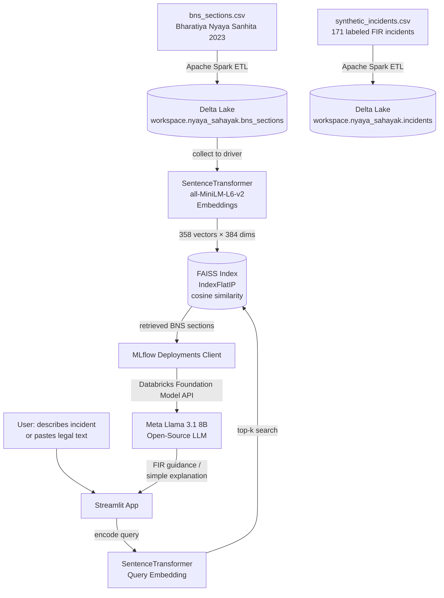

# ⚖️ Nyaya-Sahayak: Governance & Access to Justice

**Nyaya-Sahayak** is an AI-powered legal assistant that simplifies Indian law (BNS 2023) for common citizens and helps them identify the correct FIR sections for any incident — built entirely on open-source models and Databricks.

---

## Architecture



---

## What it does

**Task 1 — Legal Simplifier:** Paste any BNS or Constitution text → get a plain-English explanation written for a 15-year-old, powered by Llama 3.1 8B.

**Task 2 — FIR Category Helper:** Describe an incident ("Someone stole my bike") → FAISS retrieves the most relevant BNS sections → Llama 3.1 suggests the offense type, applicable sections, and step-by-step FIR filing advice.

---

## Databricks Technologies Used

| Technology | Usage |
|---|---|
| Apache Spark | ETL pipeline — reads CSVs, cleans data, writes Delta tables |
| Delta Lake | Managed storage for BNS sections and incident dataset |
| Databricks Foundation Model APIs | Serves Meta Llama 3.1 8B (open-source) |
| MLflow Deployments | Client to call the Foundation Model API endpoint |
| Unity Catalog | Manages Delta tables and Volume storage |

## Open-Source Models Used

| Model | Usage |
|---|---|
| `sentence-transformers/all-MiniLM-L6-v2` | Encodes BNS sections and user queries into vectors |
| `meta-llama/Meta-Llama-3.1-8B-Instruct` | Legal simplification and FIR guidance (via Databricks) |
| FAISS (`IndexFlatIP`) | Cosine similarity search over BNS section embeddings |

---

## How to Run

### Prerequisites
- Python 3.9+
- A Databricks workspace (Free Edition works)
- Databricks Personal Access Token (`dapi...`)

### 1. Clone the repo
```bash
git clone https://github.com/algorithmalchemist69/nyaya-sahayak.git
cd nyaya-sahayak
```

### 2. Install dependencies
```bash
pip install streamlit faiss-cpu sentence-transformers "numpy<2.0" openai
```

### 3. Generate synthetic dataset
```bash
python 01_generate_synthetic_data.py
```

### 4. Build FAISS index
```bash
python 03_build_faiss_index.py
```

### 5. Run the Streamlit app
```bash
streamlit run 04_nyaya_sahayak_app.py
```

Open `http://localhost:8501` → paste your Databricks token in the sidebar → use the app.

---

### Running the Databricks Pipeline (optional — for full Spark + Delta Lake flow)

Import these notebooks into your Databricks workspace in order:

```
databricks/nb_00_setup.py      → installs packages
databricks/nb_01_etl.py        → Spark ETL → Delta tables
databricks/nb_02_build_faiss.py → builds FAISS index
databricks/nb_03_inference_demo.py → interactive demo
```

Run them top to bottom using Serverless compute.

---

## Demo Steps

### Task 1 — Legal Simplifier
1. Open the app → click **"📖 Explain Like I'm 15"** tab
2. Paste this text:
   ```
   Whoever commits theft shall be punished with imprisonment of either description
   for a term which may extend to three years, or with fine, or with both.
   ```
3. Click **Simplify ✨**
4. See plain-English explanation with a "What this means for you" note

### Task 2 — FIR Category Helper
1. Click **"🚨 FIR Category Helper"** tab
2. Select **"Someone stole my bike"** from the dropdown
3. Click **Analyse & Suggest FIR Sections 🔍**
4. See: FAISS retrieves BNS Section 305 (Theft), Llama 3.1 explains it and gives FIR steps

Try also:
- `My husband beats me and demands dowry` → Sec 80 (Dowry Death) + Sec 85 (Cruelty)
- `My phone was hacked and money was stolen` → Cybercrime + Sec 316

---

## Dataset

- **BNS 2023**: Official Bharatiya Nyaya Sanhita 2023 — 358 sections across 20 chapters
- **Synthetic Incidents**: 171 labeled FIR incident descriptions across 16 offense types (generated)

Source: [India Code — BNS 2023](https://www.indiacode.nic.in/handle/123456789/20062)

---

## Live Demo

[https://algorithmalchemist69-nyaya-sahayak.streamlit.app](https://algorithmalchemist69-nyaya-sahayak.streamlit.app)
